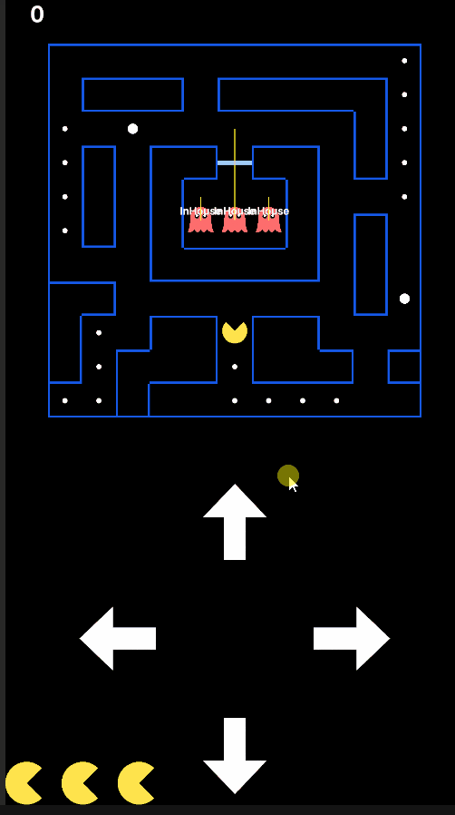

# PAC-MAN Case Study



## Scope
- `main` — istenen case: Pacman hareketi, 4 state'li ghost AI (InHouse/JoiningGame/Scatter/Chase), yakalanma → fail animasyonu; ek olarak otomatik restart, editor gizmo'ları ve unit testler.
- `feature/core-loop` — ekstralar: collectable'lar + win condition, frightened mode + ghost eating, score, can sistemi, level döngüsü.

## How to Run
`Assets/Scenes/GameplayScene.unity` sahnesini açıp Play'e basın. Yön, ekrandaki butonlarla veriliyor.

<details>
<summary><b>Development Log</b></summary>

- **Day 1 (Jul 7)** — Proje kurulumu, iskelet kodun incelenmesi, Pacman grid hareketi.
- **Day 2 (Jul 8)** — Ghost spawn + InHouse state, staggered join delay'ler, turn/reversal hız düzeltmesi.
- **Day 3 (Jul 9)** — JoiningGame + BFS pathfinding, GridMover extraction, Scatter ve Chase state'leri (line-of-sight → game over).
- **Day 4 (Jul 10)** — Editor tooling (assembly definitions + ghost gizmos), input button UI, walkability merkezileştirme + pathfinding allocation azaltma.
- **Day 5 (Jul 11)** — Chase corner-lock, in-place respawn ile auto-restart, README + branch/tag ayrımı.
- **Day 6 (Jul 12)** — Saf mantık için EditMode unit testleri; collectable'lar + win condition, score + HUD.
- **Day 7 (Jul 13)** — Frightened mode + ghost eating (görseller ve davranış fix'leri), can sistemi + full reset, level döngüsü.

</details>

## Architecture

- **GameManager** — Sahnedeki entry point. Prefab'ları yükleyip aktörleri instantiate eder, bağımlılıklarını `Init` ile geçirir; her frame collectable ve catch kontrolü yapar; global mode'u (Scatter/Chase/Frightened), score/can ve level akışını tutar.
- **GridMover** — Pacman ve ghost'ların paylaştığı plain C# movement sınıfı; logical cell (`CurrentCell`) ile visual position'ı ayrı tutar, overshoot'u taşıyarak turn'lerde hızı sabit bırakır.
- **AI** — State machine + blackboard: davranış `GhostState` subclass'larında, shared data ghost başına bir `GhostBlackboard`'da. Ghost yalnızca aktif state'in `Update`'ini çağırır.
- **Pathfinding** — Walkability'i `Func<Vector2Int, bool>` predicate ile dışarıdan alan statik BFS; aynı arama state'e göre farklı kurallarla çalışır.
- **HudManager** — Skor text'ini ve can ikonlarını gösteren prefab view; veriyi tutmaz, GameManager mevcut değerleri basar.
- **Editor tooling** — Runtime ve editor kodu ayrı assembly'lerde (`CMP` / `CMP.Editor`); `[DrawGizmo]` ghost state'ini ve sight'ını Scene view'da çizer, build'e girmez.

## AI States

| State | Davranış | Geçiş |
|-------|----------|-------|
| InHouse | Spawn bölgesinde bekler, kenara gelince yön değiştirir. | Join delay (3 / 6 / 9 sn) dolunca → **JoiningGame** |
| JoiningGame | Kapıdan (AiGate) geçip labirente BFS yolunu izler. | JoinGameCell'e varınca → **Scatter** |
| Scatter | Rastgele, geri dönmeyen yönlerde ilerler; her hücrede line of sight tarar. | Pacman'i görünce → **Chase** ve global modu Chase yapar; mod Chase ise de geçer. Mod Frightened olunca → **Frightened** |
| Chase | Pacman'e doğru yol bulur, köşelerde yeniden hesaplar. | Mod Frightened olunca → **Frightened**. Normal modda yakalama can kaybettirir; Restart tüm ghost'ları **InHouse**'a döndürür. |
| Frightened | Girişte yön çevirir; rastgele, geri dönmeyen yönlerde yavaşlamış kaçar. Mavi görünür, süre biterken yanıp söner. | Süre dolunca → **Scatter**; pacman'e yakalanınca → **Eaten** |
| Eaten | Gövde kapanır (sadece gözler), 2x hızla BFS ile spawn'a döner. | Spawn'a varınca → **InHouse** |

## Kararlar & Trade-off'lar

**No DI framework** — Zenject/Reflex gibi bir DI framework'ü bu scope için overkill'di: injection noktası az ve hepsi tek yerden (GameManager) bağlanıyor. Okunabilirlik ön planda olduğundan bağımlılıkları `entity.Init(...)` ile elle dağıttım. MonoBehaviour'lar Instantiate edilince constructor argümanı alamadığı için bağımlılıklar Init üzerinden geçiyor.

```csharp
// GameManager.cs — LoadLevel() ve SetupEnemies(): bağımlılıklar elle dağıtılır
_pacman.Init(_inputManager, gridData);                 // LoadLevel()
ghost.Init(gridData, spawnPos, GetJoinDelay(i), this); // SetupEnemies()
```

```csharp
// Ghost.cs — Init(): ihtiyacı olanı Init ile alır
public void Init(GridData gridData, Vector2Int spawnGridPos, float joinDelay, GameManager gameManager)
{
    _spawnGridPos = spawnGridPos;
    _blackboard = new GhostBlackboard(this, gridData, Direction.Up, joinDelay, gameManager, spawnGridPos);
    Spawn();
}
```

**In-place respawn (Init / Spawn split)** — `Init` bağımlılıkları bir kez bağlar; `Spawn` ise aktörü başlangıç durumuna koyan, tekrar çağrılabilir kısım. Ölümde sahne yeniden yüklenmez, aktörlerin `Spawn`'ı çağrılır; yenen collectable'lar yerinde kalır.

```csharp
// Ghost.cs — Spawn(): GameManager.Restart() tarafından tekrar çağrılır
public void Spawn()
{
    _mover = new GridMover(transform, _spawnGridPos);
    ChangeState(new InHouseState(_blackboard));
    enabled = true;
}
```

**BFS over A\*** — A* adım maliyetleri farklıyken veya heuristic ile aramayı kısaltmak istediğinde kazandırır; bu grid'de her adımın maliyeti eşit ve harita küçük. BFS zaten en kısa yolu veriyor ve daha sade, o yüzden A*'a gerek görmedim.

**Statik offset dizisi (GetNeighbours yerine)** — `GetNeighbours` her çağrıda yeni bir `List` döndürdüğü ve BFS her düğümde komşulara baktığı için statik bir offset dizisi kullandım; düğüm başına allocation olmuyor. `GetNeighbours` iskeletle gelen ama proje boyunca kullanılmayan tek extension method.

```csharp
// Pathfinding.cs — class field, FindPath() komşuları bununla gezer
private static readonly Vector2Int[] Offsets =
    { Vector2Int.left, Vector2Int.right, Vector2Int.up, Vector2Int.down };
```

**Collectable'larda Destroy yerine SetActive** — Yenen pellet kapatılır, yok edilmez: ölümde yenenler yenmiş kalır, ayrı bir pool sınıfı kurmadan instance'lar yeniden kullanılır. Level geçişi (cold path) ise yık-yeniden kur.

**Level döngüsü** — İskeletin `GridData` asset'i level 0; ek leveller `Resources/Levels/` klasöründen isim sırasıyla yüklenir, son levelden sonra başa sarar. Yeni level eklemek = klasöre asset eklemek, kod değişikliği yok. Level geçişinde runtime üretilen harita texture/sprite'ı elle Destroy ediliyor — GameObject ile birlikte ölmezler.

**Frightened'da klasikten bilinçli sapmalar** — Klasikte frightened sırasında evden çıkan ghost normal renkte ve tehlikelidir; burada labirente girince frightened olur ki "mavi = yenilebilir" tek kural kalsın. Yenilen ghost eve dönüp çıktığında süre bitmediyse yeniden mavileşebilir.

## Tests
`Assets/CMP/Tests/EditMode` — saf mantığın EditMode unit testleri: BFS pathfinding (en kısa yol, dolaşma, ulaşılamaz hedef), GridMover (snap + overshoot taşıma), yön seçimi (DirectionPicker invariant'ları) ve yön/hücre dönüşümleri. Window → General → Test Runner'dan koşulur. State machine bilinçli olarak kapsam dışı: sahne bağımlılığı unit'e uygun değil; davranış editor gizmo'ları ve play üzerinden gözlemleniyor.
